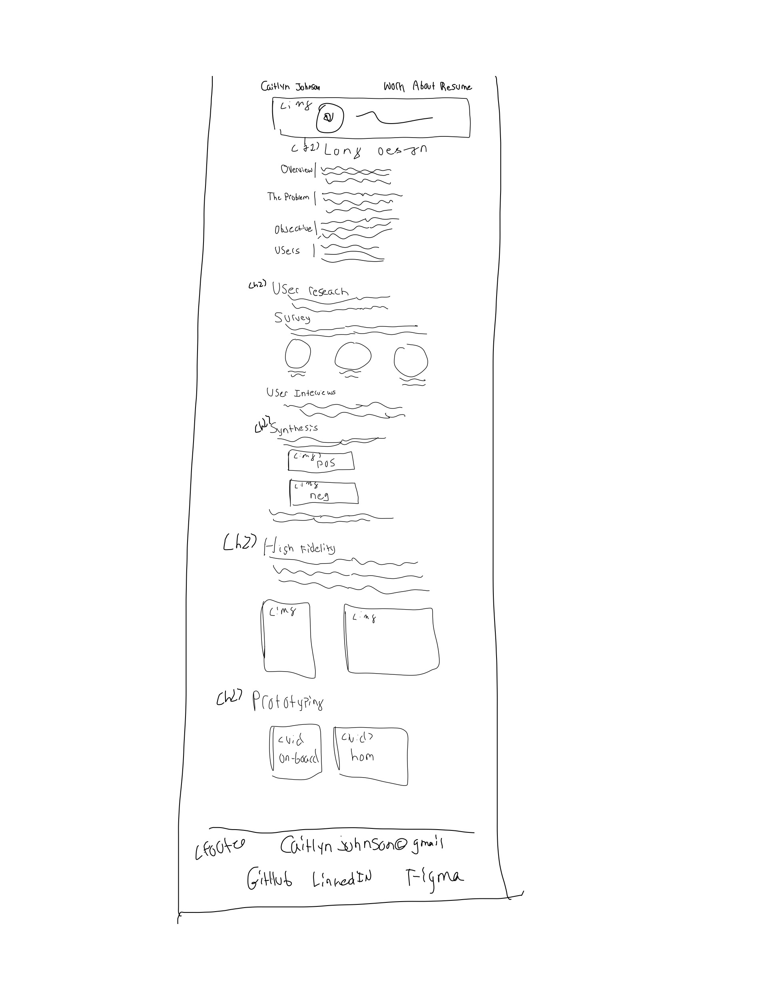
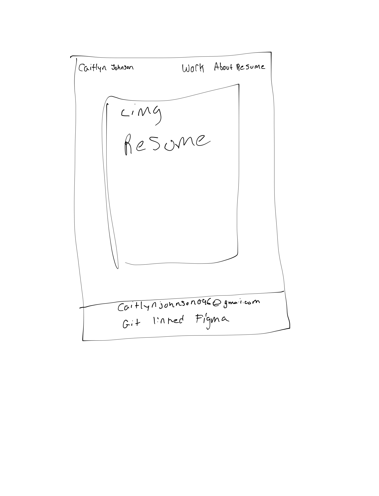
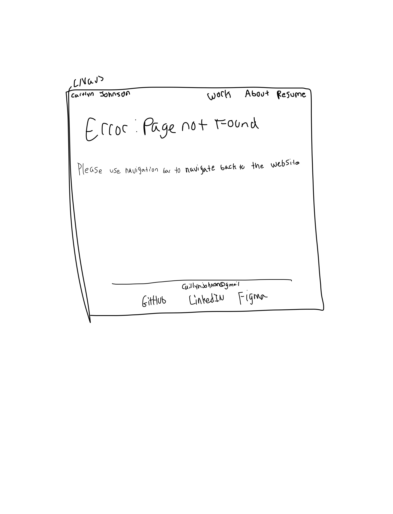

# Project 1: Design Journey

**For each milestone, complete only the sections that are labeled with that milestone.** Refine all sections before the final submission. If you later need to update your plan, **do not delete the original plan, leave it place and append your new plan below the original.** Explain why you are changing your plan. Remember you are graded on your design process. Updating the plan documents your process!

**Replace ALL _TODOs_ with your work.** (There should be no TODOs in the final submission.)

Be clear and concise in your writing. Bullets points are encouraged.

**Everything, including images, must be visible in Markdown Preview.** If it's not visible in Markdown Preview, then we won't grade it. We won't give you partial credit either. Your design journey should be easy to read for the grader; in Markdown Preview the question and answer should have a blank line between them.

## Existing Design (Milestone 1)

**Make the case for your decisions using concepts from class, as well as other design principles, theories, examples, and cases from outside of class (includes the design prerequisite for this course).**

You can use bullet points and lists, or full paragraphs, or a combo, whichever is appropriate. The writing should be solid draft quality.

### Existing Site: The Site (Milestone 1)
> What is your existing site about? Tell us about it.

My existing site is that includes information about me mostly relating to my work and career goals. My personal site includes some of my previous design work that documents the human-centerted design process and how I came to specific solutions. Additionally, the site includes a few links such as my linked-in. The site lastly has a page dedicated to my resume.

> How and where did you create this site?

I created this site over my winter break, and worked on it in my home during my free-time this winter. I created the site by using the methods learned in 1300. I created a styles, images, and scripts folder. I also created HTML files to hold all of the content. All of this code was written from scratch in Atom.

> Is this site designed for desktop, mobile devices or both?

The site was designed for both mibile and desktop, and uses media queries to do so.

### Existing Site: Audience (Milestone 1)
> Who is your _existing_ site's audience?
> Briefly explain who the intended audience(s) is for your website. Be specific and justify why this audience is appropriate for your site. You may not be the audience.

My audience is people who want to get to know more about my work and career goals. These could be people such as employeers and club recruiters The main purpose is that my audeince wants to be infomred on how my past projects align with my career goals. Moreover, my audience will likely have expereince looking at portfolios, resumes, or job applications.

### Existing Site: Audience Needs (Milestone 1)
> Document your existing site's audience's goals. (These should be informed by user research. Not assumptions.)
> List each goal below. There is no specific number of goals required for this, but you need enough to do the job.
> You may copy these from your previous project. However, I would encourage you to refine them.

Goal 1:  Use visuals in the portfolio
- **Design Ideas and Choices**
The portfolio should inccooperate a lot of images relating to the design project. These images should be well spaced out.

- **Rationale & Additional Notes** _Justify your decisions; additional notes._
  - This makes sense for this page because it will keep users interested in my work, while also creating more understanding surrounding the desings that im discussing.

Goal 2: Include information about me that doesn't include work.
- **Design Ideas and Choices**
The possibility could be to include image and about me information either on the home page or in an about us section.
- **Rationale & Additional Notes** _Justify your decisions; additional notes._
  - It appears especially during club requirement that people who view this site may value understaing a bit of personal information about the canditate.

Goal 3: Use Desisgn elements to create well organized site

- **Design Ideas and Choices**
Make sure that the naviagation bar aligns well with the topics preesented on each site page.
- **Rationale & Additional Notes** _Justify your decisions; additional notes._
  - Recruiters do not have time to througly investigate your website if they can not easily find the imformatiin that they are looking for then they may give up in trying to find this information. They may also become frustrated with the canditate.

### Existing Site: Design/Sketches (Milestone 1)
> Sketch your existing site. Include these sketches here.
> DO NOT COPY SKETCHES FROM THE ORIGINAL ASSIGNMENT!
> Create new sketches here. This is part of the design process to get you thinking about the strengths/weaknesses of the current design.
> Provide a brief explanation _underneath_ each sketch.

This is a sketch of the clarks project page. The page dsicusses the user-centered design process, and how the final project was developed. It inlcudes both images and text-description. This page is the same on mobile and desktop.

Thios is the home page and it contains iformation about me information on how to access my linked-in, a picture of me, and my favorite project at time. This page is the same on mobile and desktop.

This is a sketch of the longevity design project page. The page dsicusses the user-centered design process, and how the final project was developed. It inlcudes both images and text-description, as well, as high-fidelity sketchs .

This is a page that shows the links to my work and has pictures and a small description of each project.

This page contains an image of my resume. This is the same on both desktop and mobile.

This is a page that shows the links to my work and has pictures and a small description of each project. This is rearranged vertical instead of horixontal for mobile

This is a sketch of the longevity design project page. The page dsicusses the user-centered design process, and how the final project was developed. It inlcudes both images and text-description, as well, as high-fidelity sketchs . The sketches are rearranged to work for mobile

## Refined Design (Milestone 2)

### Refined Design: Persona (Milestone 2)
> Use the goals your identified above from user research to develop a persona of your site's audience.
> Your persona must have a name and a "depiction". This can be a photo of a face or a drawing, etc.
> There is no required format for the persona.
> You may type out the persona below with bullet points or include an image of the persona. Just make sure it's easy to read the persona when previewing markdown.
 Source: maxpixel.net

Persona's Name: Stephanie

Stephanie is a junior who recruits for a club a college. Her club specializes in graphics and UX design.

Factors that influence behavior

- She has recruited students before and is familar with what a portfolio should look like.
- Stephanie likes to review the portfolio with candidates during their interviews
- About 50 kids apply to Stephanies club a semester.

Needs/Obstacles/Desires

- Stephanie has a lot of school work and values her time.
- Stephanie wants to be able to see the designers best work and their process.
- Stephanie tends to see only portfolios of students and never those of adults with more work expereince
- wants a professional feeling site

### Refined Design: Content Organization/Navigation (Milestone 2)
> Identify the content that is necessary for your persona. **Refer to the persona by name.**
> List the content here. Label the content as "(new)" if it's new to the existing site.
> **Don't forget to include the form.**

- Picture of me
- links (github, linked in , figma, etc)
- Resume
- documentation of design process for longetivtiy project
- final product of longevity project
- documentation of design process for clarks
- final project of clarks (new)
- cards containing images of work and link to work
- description of me
- contact information

> Organize the content for the audience and identify possible pages for the content using card sorting.
> Document your card sorting by taking a photo and including it here.
> You are **required** to show the alternative organization you considered. (1 card sort is not enough)

> Explain your thought process behind the card sorting. **Refer to the persona by name in your explanation.**

I knew that stephanie main objective is not to learn about me, but rather my work. I know that stephanie doens't have much time to navigate muy site to find what she is looking for. Tehreofe, after card sorrting, I want to introduce who I am on the front-page but not go into my detail and take away from my work. A lot of site as is takes up room not giving Stephanie what she wants to see. Therfore, when card sorting, I tried to make my work the center-piece of the website and move this information to be stadnalone and clearly important. Additiaonlly, I did want to the website to feel personal, so I knew that it would still be important to include information abut my self but just not make it the center of my website.

> Lastly, list the pages that resulted from your final card sort (i.e. your site's navigation) and content for each page.

- Work
  - breif introduction to me
  - cards to my work
  - links to my stuff contact
  - clarks card
    - wbpage with my design journey, iamges, and final prodcut
  - long gevity
     - wbpage with my design journey, iamges, and final prodcut
- About
  - longer description of me
  - picture of me
  - links to my stuff /contact information
- reusme
  - contains image of resume
  - links to my stuff /contact

### Refined Design: Design (Milestone 2)
> Refine the design of your site to meet the goals of your users using your persona.
> Include sketches of each page of the refined design.
> Provide a brief explanation _underneath_ each sketch.
> Document your _entire_ design process. **Show your preliminary sketches and your final sketches.** **We want to see iteration!** You must have multiple iterations of each page for full credit.
> **Refer to your persona by name in each explanation.**

This iteration was for mobile. This page is designed has more of a stacked verticle layout to look good on a mobile phone. Moreover, it also ensures taht the caitlyn johnson and text is centered so that there is not too much white space. This works well for stephanie because in the rare instance that she does use her mobile phone to view my wpork it needs to be visible.

This iteration keeps my name and descritption of me on the left side of the page. It also explores the desctiption of my priject as horizonatl words divided by dots. This works well for stephanies because it gives her a breif easy dexcription of the project so that she can quickly find it and navigte to the one that she would like to view

This sketch explores my name as centered and with my project description as a list. This iteratio however leaves too much white spave to either side of my desciption making it look off. This would work not quite as well for srephanie because the layout it is a little lionger and less clear, but would still allow her to find my work fairly quickly.

This is the mobile sketch of the page about me. This moves the picture of me to the top and has the decription of me on the bottom. This prevents the site from being cramped. This works well for stephanie because if it were to be laid out horizontally there is a chnce that stephanie would not be able to red the descritpion about me.

This  iteration looks at a circluar image and a caption to the side. This looks more like the mobile version of the site. It wodks well at feeling up white space.This works well for stephnie because if she were to resize her page I wouldnt want the change between desktop and mobile to be too jarring for her as in the other iteration it changes to a square. Moreover, this allows stephanie to see the picture of me and writing at the same time which is perferable because it is unlikely that her true interst in me is my photo but rather my story.

This iteration aslo has too much white space and the square photo appears to be a little too rough in the design and doestn't flow as well. This design does not make a lot of sense for pursing stephanie's needs because she is likely to want to read the descriptiin rather than see a photo of me.

An attempt ot consolidater from original site because it is very long. However, this losses flow for stephnie she is trying to read my work like it is an essay it does not make sense for it to be staggered in a way that deos not intutively follow the human centered design process.

While, this sketch isnt as consolidted and doesn't make as good of use of white space it likely works better for stephnaie as she is tryin to understand my design process and it is easier to follow this way.

This is the final impelemnetation of the clarks page. This page treats the information like an essay and keeps it dynamic by using multi-colored divs this works well for stephanie because it is liekly that she wants to see somthing basic but eye catching. Additioanlly, I did change from using java script to using divs to show the sketvhes. After, diing some research I realized that (looking at other protfolio) I realized that stephanie would not want to go looking for these sketches because she is low onm time and it is better to incooperate them into the page. Moreoiver, I removed the header image because it didn't make sense to me to incooperate another sites logo there or a screenshot because it may make stepahnie believe that she has left my portfolio.

This sketch works well for stephanie because it is set up like and essay and also includes the footer, which the original did not have this gives her easy access to my contact info.

This page breaks up the content in a more dunamic way. This suites stephnaies needs because it shortens the project at the beginning to tell stephanie exactly what she needs to know.

This is the final and implemented iteration. This continues to set up the page like an essay for stephnie, but also uses project summay and divs together to create a more dynamic looking essay that keeps stephanie involved. I also decided to cut out the protoytping because the videos are on youtube and I did not want to link to them for this project.

reamains same as previous excpet includes a footer no special design technique not many elemetns

### Partial Plan (Milestone 2)
> Using your refined sketches, plan your site's partials.
> You may describe each partial or sketch it. It's up to you!

My first partial will be the navigation bar / header as it takes place on a handful of pages. It will inclub my name and all of the navigation links as well. This is found at the top of every page so it will be useful to make it a header.

My other partial will be the footer this include my personal links as well as my email. I figre that it is important for the user to be able to access this information form any page on the site. Therefore, it is avaible on all of the pages and would work well as a partial.

The customization that’s I used for this project involved underlining the page that stephanie is on at any given moment. This will help Stephanie know where she is navigating to in the page resulting in her having a better understanding of the navigation of my page.

## Complete & Polished Website (Final Submission)

### Routing (Final Submission)
> Plan your dynamic HTTP routing.
> List each route and the PHP file for each route.

I designed this for Stephanie so that she would not get frustrated when she encountered a page not found. While, Stephanie likely has design experience her technical skills aren't as up to date and 404 page not found may have confused her. Furthermore, to prevent confusion and make navigation easy I provided her with a nav bar to get back on to the part of my site that she wants to use. This overall provides a better website experience for Stephanie, which reflects better on me as the candidate.

| Route | PHP File                            |
| ----- | ----------------------------------- |
| /   | pages/home.php (or pages/home.php) |
| /about | pages/about.php                       |
| /clarks | pages/clarks.php                     |
| /longevity   | pages/long.php                     |
| /resume | pages/resume.php                     |

### Audience (Final Submission)
> Tell us how your final site meets the needs of the audience. Be specific here. Tell us how you tailored your design, content, etc. to make your website usable for your persona. **Refer to the persona by name.**

My site meets the needs of the user because the Sthephanie's goal is to locate my work, understand if i am able to go through the design process, and loook at other qualifications that I may have for the job. Srephanie is able to do this because I have moved my work to the home-page for easy access and renamed the page work rather than home in the naviagation to clarify what stephanie is looking for. Moroeoc,er I also created anb about me tab that was exclusive to telling my story that stephanie may care about, but is not her priority on the site. This way stephanie knows exactly where to go to found out more about me my intersts, and my story. Lastly, I did not change this but my navigation has a resume  part, so that stephanie can easily find it as it is crucial to the application process. Moreover, my website better suites the stepahneis needs as it is cleaner than my original site, it only uses grey, black, and pink (mostly). This gives the website a professional look with a pop of color / personality this is what stephnies is looking for as she likley wants someone who is professional.

### Accessibility Audit
> Tell us what issues you discovered during your accessibility audit.
> What do you do to improve the accessibility of your site?

From the audit, I learned that the light grey for text did not have high enough contrast and that I should change the color of it to pink for better accessiblity. Moreover, I had to change a color in one of my project pages that contianed a ligther pink. Therefore, most of issues had to do with color contrast

### Additional Design Justifications (Final Submission)
> If you feel like you haven’t fully explained your design choices in the final submission, or you want to explain some functions in your site (e.g., if you feel like you make a special design choice which might not meet the final requirement), you can use the additional design justifications to justify your design choices. Remember, this is place for you to justify your design choices which you haven’t covered in the design journey. You don’t need to fill out this section if you think all design choices have been well explained in the design journey.

One of my choices was to make the site color more professional by moving away from the blues, pinks, and more fun colors to a more neutral colors with oios of color for personality as someone who is looking at my work experience liek stephanie would prefer that Additioanlly, I changed the nav bar and footer to be more miminialistic because I also thought that stepahnie wouldn't like such drastic color changes because it takes away from the work.

### Self-Reflection (Final Submission)
> Reflect on what you learned during this assignment. How have you improved from 1300? What things did you have trouble with?

From 1300, I learned about accesibility and coilor conterast. I find that expecially when I am working with lighter color backgrounds that I tend to use to light of text on top. Moreover, I learned how to create customized routing which helped me improve the persoanlization and accesibility of the site. This is important because it makes it easier for the user to access pages on your site as well as navigate back to the page when they get an error. I did stuggles a little bit with uses some of the div boxes on the homepage. It took me a while to debug the project cards and was really challenging. I also struggled with styling the navigation bar and then ultimately settled on reversing its order.

> Take some time here to reflect on how much you've learned since you started this class. It's often easy to ignore our own progress. Take a moment and think about your accomplishments in this class. Hopefully you'll recognize that you've accomplished a lot and that you should be very proud of those accomplishments!

I havw learned a lot since the beginnin of this class. I have learned how to create partials, so that I do not have to reuse the same code over and over again when creating a website. Moreover, I have also learned how to create custiomization on each of these files so that the user has a more persoanlized and interactive experince. Another thing that I have learned since the start of the year is how to create a user persona to meet a user's needs and match their story and what they wish to get out of the site, I also know how to custimize the urls in a website ot make them more user accesible.

### Grading: Mobile or Desktop (Final Submission)
> When we grade your final site, should we grade this with a mobile screen size or a desktop screen size?

- desktop screen size and this is because it fits stephanies needs the best since she is likely using this site in professional setting she will need to see in desktop

### Grading: Partials (Final Submission)
> Clearly list each partial file and where you used it.

- nav.php: I created the navigation bar and used on each of the pages of the site. This header included the naviagation bar that showed the title of all the sites that the user could possibly navigate to.
- footer.php: the footer appears on each page of the website at the bottom it has the

> Which partials have customization? Explain how the customization looks in the browser.

- The customization that’s I used for this project involved underlining the page that stephanie is on at any given moment. This will help Stephanie know where she is navigating to in the page resulting in her having a better understanding of the navigation of my page.

### Grading: Open the Design Journey in Markdown Preview
> Preview your design journey in VS Code. Please verify that this document is easy to read/grade.
> - All images must be visible.
> - All images must be oriented the correct way.
> - There should be a blank line between the question prompt and your answer.
> Is your design journey easy to read?

TODO
